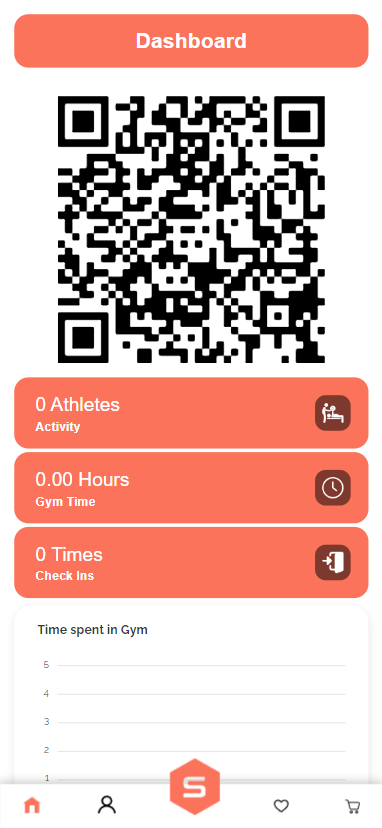

# SmartFit

This project is designed for scanning and allowing access in a gym. It also has a section where you can buy different subscriptions.

## Requirements

For this project you will need:

- Node v12.18.0
- Yarn

## Project setup

To install the necessary libraries and dependencies you can use:

```
yarn install
```

To run this project in dev mode:

```
yarn dev
```

To build the project for production:

```
yarn build
```

## Key features

In this project you can find features like:

- Authentication system with JWT
- Generated QR Code based on given ID
- Instant update QR Code after scanning using Socket.IO
- Consuming REST API using Axios
- Routing using Vue Router
- State Management using Vuex
- Form Validation
- Generating statistics using ApexCharts
- Custom reusable components made with Vue.JS & SCSS
- Admin Panel for easy platform management
- Responsive design

...and many more!

## Demos

### Home Page

After logging in your account, you can scan a unique QR Code generated for your access in gym. You can also see some statistics like how many people are in gym at that moment, how many hours you've spent in gym in total and a total of your check-ins.

- Note that QR Code is only available on mobile since you will not need it on a desktop.
  
  

### Subscriptions Page

Here you can see the available subscriptions for purchase and add them into your cart or your wishlist.


### Disciplines Page

A list of every discipline our gym offers support for.


### Equipment Page

Every machine the gym is equipped with.


### My Account

A section where you can administrate your account information, see your active subscriptions and a history of your orders.


### Gym Dashboard (admin-only)

Dashboard filled with statistics about the gym.


### Users Management (admin-only)

Manage registered users and also update their role.


### Subscriptions Management (admin-only)

A list of all subscriptions added on the platform.


### Subscription Edit (admin-only)

Edit all the data on an existent subscription.


### Orders Management (admin-only)

A table with all the orders placed on the platform. The payment status automatically changes to "Paid (stripe)" if the subscription has paid online and it also can be changed to other status if the customer choose to pay cash.


### Discounts Management (admin-only)

You can even add discounts on subscriptions or edit the existent ones. You can add many rules like only one discount per customer, cumulative with other discounts, minimum cart value and so on.

